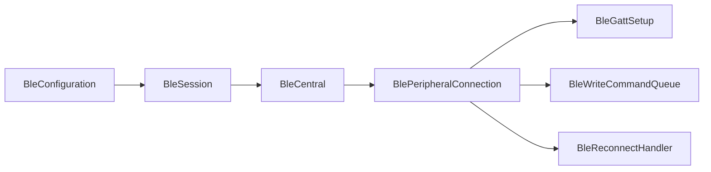

# BLE 架构完善与代码收敛

## 范围与原则
- 以 `[BleSession.swift](/Users/imac/Documents/Code/AppTemplate/AppStart/AppStart/Ble/BleSession.swift)` → `[BleCentral.swift](/Users/imac/Documents/Code/AppTemplate/AppStart/AppStart/Ble/BleCentral.swift)` → `[BlePeripheralConnection.swift](/Users/imac/Documents/Code/AppTemplate/AppStart/AppStart/Ble/BlePeripheralConnection.swift)` 为稳定主链，保留 `BleSession.shared`、扫描替换语义、同设备连接合并、动态 GATT merge、写队列与自动重连契约。
- 不做整体 `@MainActor` 迁移，不移除 `discoverDescriptors` 等公开 API；不实现 Service Changed、State Restoration 或 OTA 协议。只做可验证、低风险、最小 diff 的精简，并保留/同步全部现有有效注释。

## 实施步骤
1. **收敛现有代码与注释**
   - 全量复核 17 个 Swift 文件，仅落地不改变行为的优化；已确认优先项是 `[BleSession.swift](/Users/imac/Documents/Code/AppTemplate/AppStart/AppStart/Ble/BleSession.swift)` 批量注册时一次性追加并同步日志，避免逐项重复同步。
   - 修正 `[BleCentral.swift](/Users/imac/Documents/Code/AppTemplate/AppStart/AppStart/Ble/BleCentral.swift)` 中仍称连接直接使用 `discovery.configuration` 的旧注释，使其与 `effectiveConfiguration` 一致。
   - 对 `discoverDescriptors` 保持兼容，明确它目前只触发发现、未暴露 descriptor 结果；不为“精简”删除公开能力或改动状态机。

2. **修复并补强自动化验证**
   - 将 `[BleModuleSpec.swift](/Users/imac/Documents/Code/AppTemplate/AppStart/Example/Tests/BleModuleSpec.swift)` 两处错误参数 `interval` 修正为现有 API `retryDelay`，恢复 UT-04/UT-05 可编译性。
   - 在不依赖真实外设的边界内补充低成本回归断言，重点覆盖批量注册顺序/幂等配置、产品 resolve 顺序或可直接测试的配置行为；复杂 CBCentralManager/CBPeripheral mock 不在本轮强行引入脆弱测试替身。

3. **补全权威实现文档**
   - 更新 `[BLE_README.md](/Users/imac/Documents/Code/AppTemplate/AppStart/AppStart/Ble/BLE_README.md)`：修复 AppTemplate 文档断链；把连接链改为 `effectiveConfiguration`；补齐完整 `BleError`、阶段 2 API、配置快照、扫描/连接/重连/写入状态流、并发归属、MTU/背压、扩展指南和已知限制；文件索引补齐架构评审与验证清单。
   - 明确单一事实来源：README 记录当前实现与接入方式，架构评审记录判断和边界，Roadmap 只记录未来能力，Validation 只记录验收。

4. **同步评审、路线图和约束文档**
   - 更新 `[BLE_ARCHITECTURE_REVIEW.md](/Users/imac/Documents/Code/AppTemplate/AppStart/AppStart/Ble/BLE_ARCHITECTURE_REVIEW.md)`：关闭已落地的 typed accessor、幂等注册、错误语义等旧建议；更新测试覆盖；补组件职责、状态所有权、并发边界及阶段 3 设计约束。
   - 更新 `[BLE_ROADMAP.md](/Users/imac/Documents/Code/AppTemplate/AppStart/AppStart/Ble/BLE_ROADMAP.md)`：刷新日期/状态，修正 `BleUUID.equivalent` 为 `BleUUID.matches`，校准 Release 1/2 完成项和 Release 3 待办。
   - 更新 `[BLE_VALIDATION_CHECKLIST.md](/Users/imac/Documents/Code/AppTemplate/AppStart/AppStart/Ble/BLE_VALIDATION_CHECKLIST.md)` 的自动化覆盖说明与新增文档契约；在 `[AGENTS.md](/Users/imac/Documents/Code/AppTemplate/AppStart/AppStart/Ble/AGENTS.md)` 补全权威文档链接和目录大小写约束。统一仓库 canonical 路径为 `AppStart/Ble`。

5. **验证与最终复核**
   - 运行 `BleModuleSpec` 对应测试或可用的 `xcodebuild test`；若本机 simulator/scheme 不可用，则至少完成 Pod/App target 编译并准确记录环境限制。
   - 检查改动文件 IDE 诊断、文档相对链接、Swift diff 与注释净删除；确保无公开 API 破坏、无无关重构，并把尚需真机验证的项目留在验证清单中。